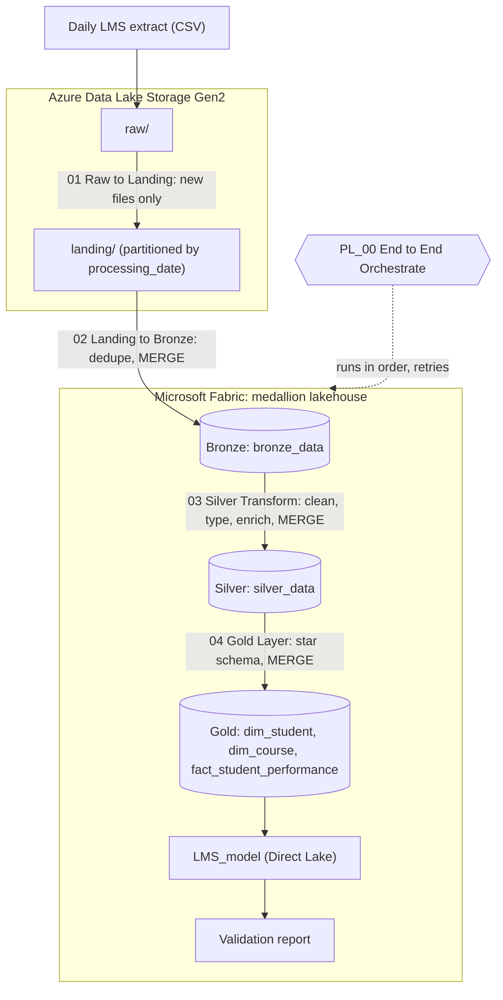
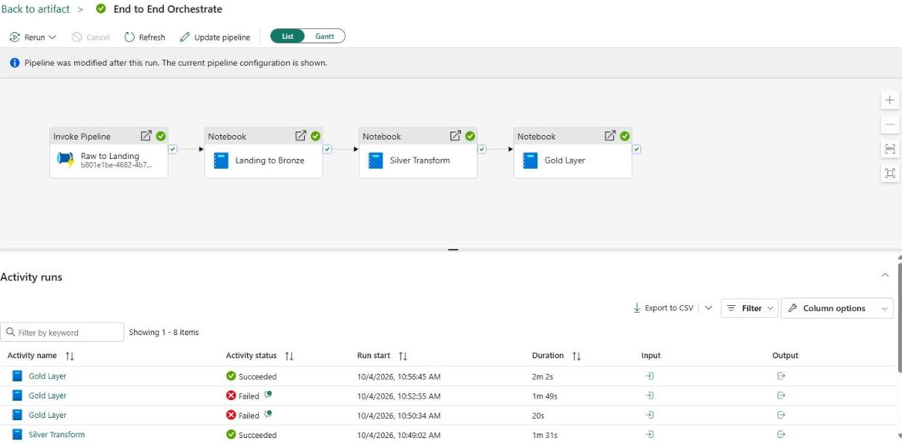
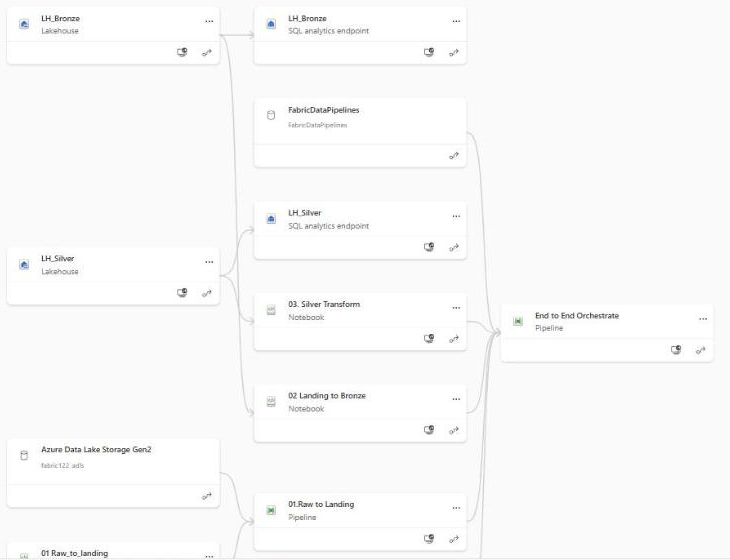
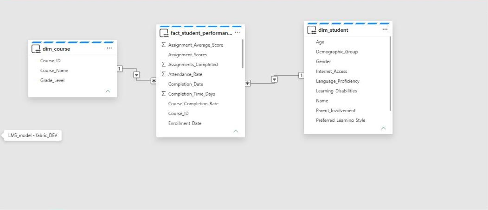
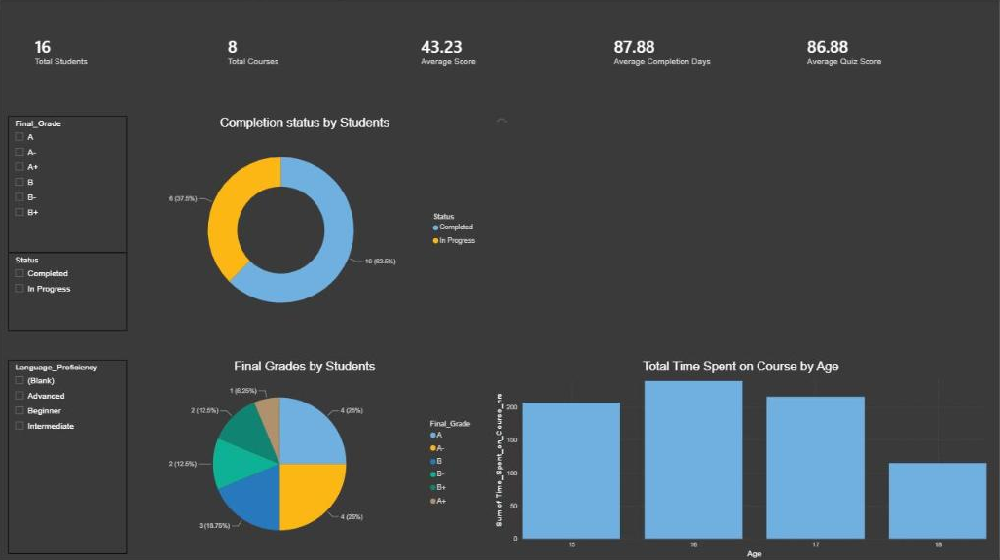
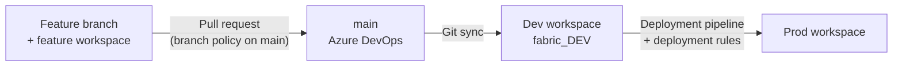

# LMS Student Performance: End to End Data Engineering on Microsoft Fabric

[](https://github.com/anson4747/fabric-lms-medallion-pipeline/actions/workflows/ci.yml)


An end to end lakehouse pipeline on **Microsoft Fabric** that ingests daily Learning Management System (LMS) extracts from **ADLS Gen2**, refines them through a **medallion architecture** (Landing, Bronze, Silver, Gold) with incremental **Delta Lake MERGE** loads, and serves a **Direct Lake** Power BI model. The workspace is version controlled with **Fabric Git integration (Azure DevOps)** and promoted from Dev to Prod with **Fabric deployment pipelines**.

> **Focus of this project:** the data engineering behind the insight, from raw files to a governed, version controlled, deployable pipeline. The Power BI report is intentionally basic. It exists to prove the Gold layer and the Direct Lake model work end to end, not to showcase dashboard design.

## Highlights

* **Incremental ingestion:** only files modified today are picked up from ADLS Gen2 and landed into date partitions
* **Idempotent medallion loads:** Bronze, Silver and Gold are upserted with Delta Lake `MERGE` on business keys, so reruns do not duplicate data
* **Data quality in Silver:** deduplication, key validation, defaults, typed dates, logical consistency checks and derived business metrics
* **Star schema served through Direct Lake:** no import refresh between Gold and Power BI
* **Workspace as code:** every Fabric item is versioned in Git, with feature branches, a protected `main`, and a Dev to Prod deployment pipeline
* **Tested outside Fabric:** the transformation logic has unit tests and runs end to end on synthetic data in GitHub Actions

This repository holds the Fabric item definitions exported from the workspace, plus a local, tested copy of the transformation logic so the pipeline can be reviewed and validated without a Fabric capacity.

## Architecture



All four steps are orchestrated by **PL_00_End_to_End_Orchestrate**, which invokes the ingestion pipeline and then runs the three notebooks in sequence in a shared high concurrency Spark session (`sessionTag: lms_pipeline`), with 2 retries per notebook.

| Layer | Storage | What happens |
|---|---|---|
| Raw | ADLS Gen2 `raw/` | Source system drops one CSV per day |
| Landing | ADLS Gen2 `landing/processing_date=YYYY-MM-DD/` | A Get Metadata activity picks up only files modified today; a ForEach runs `01_Raw_to_Landing` per file, stamping and partitioning by processing date. Header-only files are skipped |
| Bronze | `LH_Bronze.dbo.bronze_data` (Delta) | Explicit schema on read, dedupe on `(Student_ID, Course_ID)`, upsert with SQL `MERGE` |
| Silver | `LH_Silver.dbo.silver_data` (Delta) | Drop duplicates and rows missing keys, default descriptive fields, parse dates, reject completion before enrolment, derive `Completion_Time_Days`, `Performance_Score`, `Course_Completion_Rate`, upsert with `MERGE` |
| Gold | `LH_Gold.dbo.*` (Delta) | Star schema: `dim_student`, `dim_course`, `fact_student_performance` loaded with the Delta Lake Python `merge` API, with merge metrics logged from table history |
| Serve | `LMS_model` semantic model | Direct Lake over the Gold SQL analytics endpoint, 5 DAX measures, and a basic one page validation report (see note above) |

More detail: [docs/architecture.md](docs/architecture.md)

## Screenshots from the Fabric workspace

**Orchestration: a successful end to end run** (all four stages green, about 22 minutes; the Gold step recovered from two transient failures through the retry policy)



**Workspace lineage:** ADLS Gen2 source, ingestion pipeline, notebooks, Lakehouses and orchestrator



**Gold star schema in the Direct Lake semantic model**



**Validation report.** Deliberately basic: it confirms the Gold tables, relationships and DAX measures return correct results through Direct Lake. Dashboard design was out of scope for this project.



## CI/CD



* Every Fabric item (notebooks, pipelines, Lakehouses, semantic model in TMDL, report in PBIR) is stored as code under [`fabric/`](fabric).
* `main` is protected by a branch policy, so changes arrive through feature branches, each with its own workspace, and a pull request.
* A Fabric deployment pipeline promotes Dev to Prod. Deployment rules repoint Prod at its own data sources, and the orchestrator takes the workspace and storage names as pipeline parameters so the same definitions run in either stage.
* This GitHub repo adds a CI workflow ([`.github/workflows/ci.yml`](.github/workflows/ci.yml)) that statically validates the Fabric items and unit tests the transformation logic on every push.

More detail: [docs/cicd.md](docs/cicd.md)

## Repository layout

```
fabric/                         Fabric Git integration items (workspace as code)
  01_Raw_to_Landing.Notebook
  02_Landing_to_Bronze.Notebook
  03_Silver_Transform.Notebook
  04_Gold_Layer.Notebook
  PL_00_End_to_End_Orchestrate.DataPipeline
  PL_01_Raw_to_Landing.DataPipeline
  LH_Bronze.Lakehouse / LH_Silver.Lakehouse / LH_Gold.Lakehouse
  LMS_model.SemanticModel       TMDL definition, Direct Lake
  LMS_Student_Performance.Report PBIR definition
src/lms_pipeline/               Transformation logic as pure PySpark functions
tests/                          Unit tests (pytest, local Spark)
scripts/
  generate_sample_data.py       Synthetic extract with realistic data quality issues
  run_local_pipeline.py         Runs Landing to Gold locally on a CSV
  validate_fabric_items.py      Static checks used in CI
data/sample/LMS_sample.csv      Synthetic sample data (no real student data)
docs/                           Architecture, CI/CD, engineering review
```

## Run it locally

Requires Python 3.10+ and Java 17.

```bash
pip install -r requirements-dev.txt
python scripts/validate_fabric_items.py
pytest -v
python scripts/run_local_pipeline.py --input data/sample/LMS_sample.csv
```

Example output on the bundled sample:

```
layer                               rows
raw                                  510
bronze/bronze_data                   446
silver/silver_data                   438
gold/dim_student                     221
gold/dim_course                        8
gold/fact_student_performance        438
```

## Deploy to a Fabric workspace

1. Create an ADLS Gen2 account with a container holding `raw/` and `landing/` folders, and a Fabric connection to it.
2. Create a Fabric workspace on a capacity and connect it to a Git repo containing this project, with **Git folder** set to `/fabric`.
3. Sync from Git. Fabric creates the Lakehouses, notebooks, pipelines, semantic model and report.
4. Re-bind the pipeline connections and each notebook's default Lakehouse to the new workspace.
5. Run `PL_00_End_to_End_Orchestrate` with `workspace_name`, `storage_account` and `storage_container` set for that environment.

## Engineering review and fixes

After completing the build I reviewed the committed definitions and fixed issues that would have broken incremental runs or skewed the report. Each is now covered by a unit test or a CI check.

| Issue | Impact | Fix |
|---|---|---|
| Ingestion loop passed a static file name to the notebook | Pipeline read `raw/file` instead of each new file | Pass `@item().name` and the run date |
| Gold step received `workspace = "NA"`; Bronze and Silver hard-coded `fabric_DEV` | Gold failed; Prod runs would write to Dev | Workspace and storage are orchestrator parameters, and CI rejects hard-coded workspace names |
| In-progress courses got a `12/31/9999` completion date | Latent: any in-progress row without a completion date would add about 2.9 million days to `Average Completion Days` and be labelled "Delayed" | Keep completion null, add an `In-Progress` category, compute days with `datediff` |
| Dimension sources not deduplicated before `MERGE` | Duplicate dimension rows on first load, "multiple source rows matched" failures on re-runs | Deduplicate on business keys before merging |

Full write-up and remaining recommendations: [docs/engineering-review.md](docs/engineering-review.md)

## Tech stack

Microsoft Fabric (Lakehouse, Data Factory pipelines, Spark notebooks, SQL analytics endpoint, Direct Lake, deployment pipelines) · Azure Data Lake Storage Gen2 · PySpark · Delta Lake · Spark SQL · Power BI (TMDL, PBIR, DAX) · Azure DevOps Git integration · GitHub Actions · pytest

## Acknowledgements

Built while completing the Udemy course *Master Microsoft Fabric: A Complete End-to-End Project (CI/CD)*, which provided the project scenario and dataset. The local test harness, CI workflow, Fabric item validation and the fixes above were added independently. The sample data in this repo is synthetic.

## Author

**Anson Sebastian**, Melbourne
