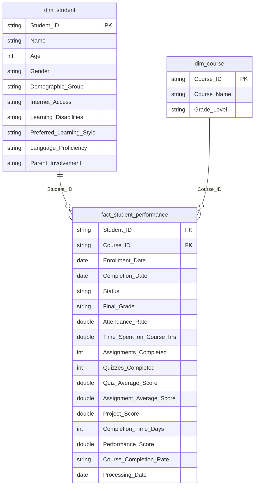

# Architecture

## Source data

A daily LMS extract (one row per student enrolment in a course, 34 columns) lands as CSV in the `raw/` folder of the `fabricproject` container on ADLS Gen2. Dates arrive as `M/d/yyyy` strings. The grain is `(Student_ID, Course_ID)`.

## Workspace items

| Item | Type | Purpose |
|---|---|---|
| `PL_00_End_to_End_Orchestrate` | Data pipeline | Runs ingestion, then Bronze, Silver and Gold notebooks in sequence, with 2 retries at 120 s each and a shared Spark session tag |
| `PL_01_Raw_to_Landing` | Data pipeline | Get Metadata (files modified between start of day and now) into a sequential ForEach that calls `01_Raw_to_Landing` per file |
| `01_Raw_to_Landing` | Notebook | Reads the file, skips header-only files, adds `processing_date`, appends to `landing/` partitioned by date |
| `02_Landing_to_Bronze` | Notebook | Reads the day's landing partition with an explicit schema, creates `bronze_data` if missing, dedupes and MERGEs on the business key |
| `03_Silver_Transform` | Notebook | Cleans, types and enriches the day's Bronze rows and MERGEs into `silver_data` |
| `04_Gold_Layer` | Notebook | Creates the star schema tables if missing and MERGEs dimensions and fact using the Delta Lake Python API, printing merge metrics from table history |
| `LH_Bronze`, `LH_Silver`, `LH_Gold` | Lakehouses | One Lakehouse per layer, schema enabled (`dbo`) |
| `LMS_model` | Semantic model | Direct Lake over the Gold SQL analytics endpoint |
| `LMS_Student_Performance` | Report | Power BI report on `LMS_model` |

## Incremental loading pattern

1. **Raw to Landing** is incremental by file modification time: the Get Metadata activity only returns files modified today, so reruns the same day are idempotent at file level and older files are never reprocessed.
2. **Landing** is partitioned by `processing_date`, so each downstream notebook reads one partition (`processing_date={today}`) instead of the full history.
3. **Bronze, Silver and Gold** use upserts (`MERGE`) on `(Student_ID, Course_ID)`. Records that change in a later extract update the existing row; new enrolments are inserted. Each table carries `Processing_Date` so Silver and Gold only process the rows that changed in the current run.

## Silver rules

| Rule | Implementation |
|---|---|
| Exact duplicates | `dropDuplicates()` |
| Missing critical fields | drop rows with null `Student_ID`, `Course_ID` or `Enrollment_Date` |
| Missing descriptive fields | defaults such as `Unknown`, `N/A`, `0` |
| Completion date | left null for in-progress courses (no placeholder) |
| Date types | `to_date(..., "M/d/yyyy")` |
| Logical consistency | reject rows where completion precedes enrolment |
| `Completion_Time_Days` | `datediff(Completion_Date, Enrollment_Date)` |
| `Performance_Score` | quiz × 0.2 + assignment × 0.2 + project × 0.1 |
| `Course_Completion_Rate` | `In-Progress` if not complete, `On-Time` if ≤ 90 days, else `Delayed` |

## Gold data model

## Semantic model and report

> The report is intentionally basic. It validates the Gold layer and the Direct Lake model end to end; the engineering work upstream is the focus of this project.

`LMS_model` uses **Direct Lake** partitions over `LH_Gold` (no import refresh needed), with many to one relationships from the fact to both dimensions.

| Measure | DAX |
|---|---|
| Total Students | `DISTINCTCOUNT(fact_student_performance[Student_ID])` |
| Total Courses | `DISTINCTCOUNT(fact_student_performance[Course_ID])` |
| Average Score | `AVERAGE(fact_student_performance[Performance_Score])` |
| Average Completion Days | `AVERAGE(fact_student_performance[Completion_Time_Days])` |
| Average Quiz Score | `AVERAGE(fact_student_performance[Quiz_Average_Score])` |

The one page validation report has a KPI card row for all five measures, a donut of completion status, a pie of final grades, a decomposition tree explaining average completion days by learning style and parent involvement, a column chart of time spent by age, and slicers for final grade, status and language proficiency.
